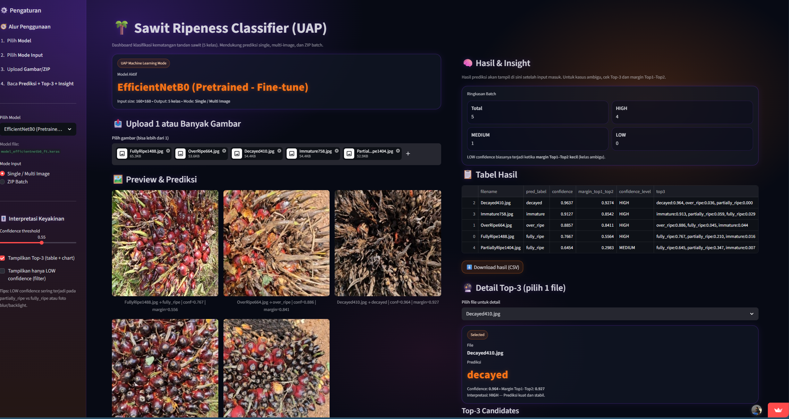
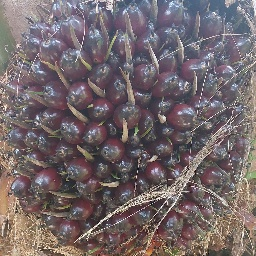
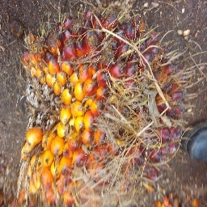
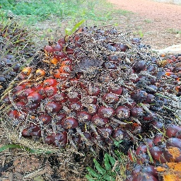
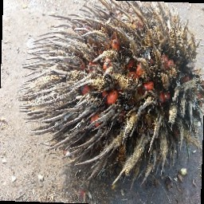
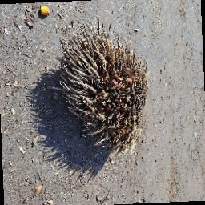

<div align="center">

# 🌴 Sawit Ripeness Classifier

### Deep Learning and Computer Vision for Oil Palm Maturity Classification


### 🔵 Academic Project (Coursework / Assignment)

🔗 **Live Demo:** https://uapmachinelearningamuhammadwildannabila202210370311252-3dgw4zg.streamlit.app/

</div>

---

# 🖥️ Application Preview



> Interactive deep learning application for classifying oil palm ripeness with multi-image support, top-3 predictions, and confidence-based insights. :contentReference[oaicite:0]{index=0}

---

# 🧠 Project Overview

This project develops a deep learning-based image classification system to identify the ripeness level of oil palm fruit bunches.

The solution combines Convolutional Neural Networks (CNN), transfer learning with MobileNetV2 and EfficientNetB0, and an interactive Streamlit application to deliver scalable and objective maturity assessment.

The project demonstrates how artificial intelligence can be applied in the agriculture domain to improve consistency and efficiency compared with manual inspection methods.

---

# 🎯 Project Objectives

- Build a baseline CNN model for benchmarking.
- Apply transfer learning to improve classification accuracy.
- Compare multiple deep learning architectures.
- Develop an interactive prediction application.
- Provide confidence-based insights for decision support.

---

# 🗂️ Dataset Overview

| Attribute | Value |
|---------|-------|
| Total Images | 5,058 |
| Number of Classes | 5 |
| Classes | immature, partially_ripe, fully_ripe, over_ripe, decayed |
| Data Split | 70% Train, 15% Validation, 15% Test |
| Image Size | 160 × 160 pixels |

---

# 🖼️ Sample Images by Class

| Class | Example |
|------|--------|
| immature |  |
| partially_ripe |  |
| fully_ripe |  |
| over_ripe |  |
| decayed |  |

---

# 🧪 Methodology

```text
Image Collection
        ↓
Exploratory Data Analysis
        ↓
Preprocessing & Normalization
        ↓
Data Augmentation
        ↓
Baseline CNN Modeling
        ↓
Transfer Learning
        ↓
Model Evaluation
        ↓
Streamlit Deployment
```

---

# 📈 Model Performance

| Model | Accuracy | Insight |
|------|---------:|--------|
| Baseline CNN | 0.61 | Limited generalization |
| MobileNetV2 | 0.758 | Stable and efficient |
| EfficientNetB0 | **0.821** | Best performance |

> 🏆 **Best Model:** EfficientNetB0

---

# ✨ Application Features

- 🤖 Multi-model selection
- 🖼️ Single and batch image upload
- 📦 ZIP file batch processing
- 🏆 Top-3 predictions with probabilities
- 📊 Confidence and ambiguity detection
- 📄 CSV export for batch results

---

# 🔍 Key Findings

- Transfer learning significantly outperformed the baseline CNN.
- EfficientNetB0 achieved the highest test accuracy.
- Visual similarity between partially ripe and fully ripe fruits remained the primary classification challenge.
- Confidence-based prediction improved interpretability and usability.

---

# 👨‍💻 My Role

This is a fully independent end-to-end project covering:

- Dataset exploration
- Image preprocessing and augmentation
- Deep learning model development
- Transfer learning and fine-tuning
- Model evaluation and error analysis
- Streamlit application development
- Deployment and documentation

---

# 🚧 Key Challenge

**Challenge:** High visual similarity between ripeness stages, especially partially ripe and fully ripe.

**Solution:** Transfer learning and fine-tuning with EfficientNetB0 improved feature extraction and significantly increased classification accuracy.

---

# 💼 Practical Impact

This system can help agricultural stakeholders to:

- Standardize ripeness assessment.
- Reduce subjective judgment.
- Improve harvesting decisions.
- Support scalable and automated quality control.

---

# 🛠️ Technology Stack

- Python
- TensorFlow / Keras
- Computer Vision
- CNN
- MobileNetV2
- EfficientNetB0
- Streamlit

---

# 🎯 Career Relevance

Relevant for roles in:

- Machine Learning Engineer
- Deep Learning Engineer
- Computer Vision Engineer
- Data Scientist
- AI Engineer

---

# 👨‍💻 Author

**Muhammad Wildan Nabila**  
Informatics — Universitas Muhammadiyah Malang

---

<div align="center">

### 🌴 Transforming Agricultural Images into Actionable Insights with Deep Learning

</div>
